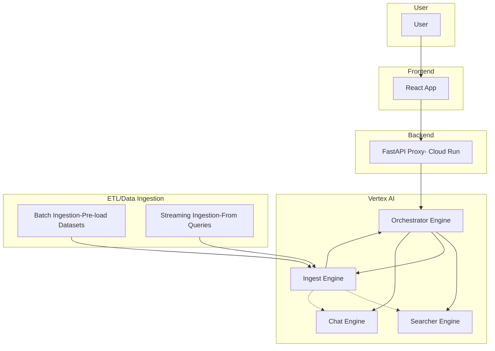

# Architecture Overview

This diagram illustrates the flow between the frontend, backend proxy (Cloud Run), and the Vertex AI backend (orchestrator and sub-engines), as well as the ETL/data ingestion process.

- **Frontend (FE):** React app served to users.
- **Backend Proxy (BE Proxy):** FastAPI app on Cloud Run, handles auth, rate limiting, error handling, and proxies requests to Vertex AI.
- **Vertex AI Backend:**
  - **Orchestrator Engine:** Main entrypoint, orchestrates sub-engines.
  - **Searcher Engine:** Handles search queries.
  - **Ingest Engine:** Handles data ingestion (from ETL or streaming).
  - **Chat Engine:** Handles chat interactions.
- **ETL/Data Ingestion:**
  - **Batch:** Pre-loads datasets into Vertex AI.
  - **Streaming:** Ingests new data as queries come in, making Vertex AI smarter over time.
