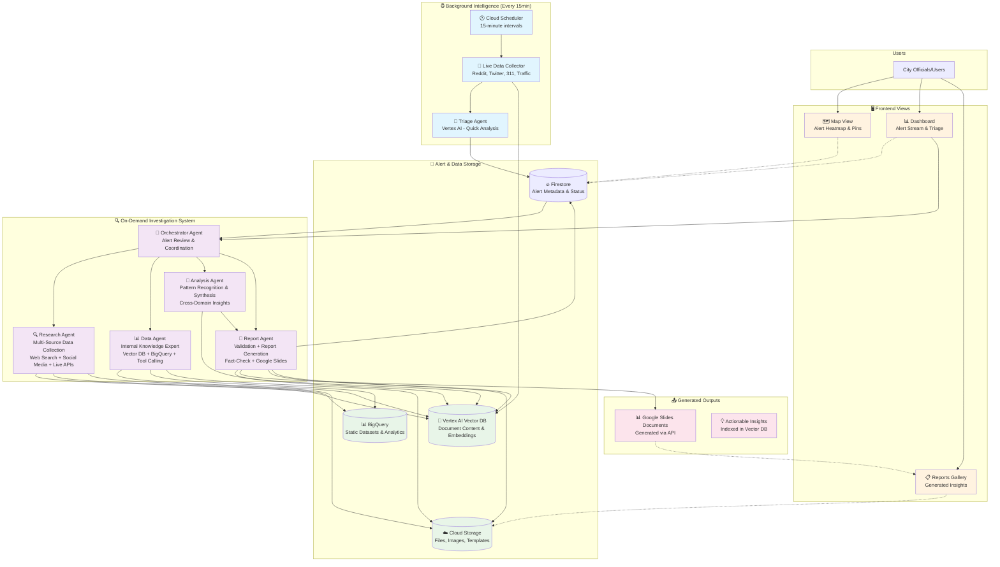

# Architecture Overview

This diagram illustrates the complete Atlas NYC Monitor system, from continuous data collection through intelligent triage to on-demand investigation and report generation.



## System Components

### 🔄 **Continuous Background Intelligence**
- **Cloud Scheduler**: Triggers data collection every 15 minutes
- **Live Data Collector**: Scans Reddit, Twitter, 311, traffic APIs for NYC signals
- **Triage Agent**: Lightweight Vertex AI analysis assigns severity scores (1-10)
- **Alert Storage**: Prioritized alerts stored in Firestore with status tracking

### 🎯 **Smart Investigation System**
- **Orchestrator Agent**: Reviews recent alerts, decides which warrant deep investigation, coordinates agent assignments
- **Research Agent**: Multi-source data collection from web search, social media, and live APIs
- **Data Agent**: Internal knowledge expert in Vector DB and BigQuery, capable of tool calling
- **Analysis Agent**: Pattern recognition and synthesis across data domains
- **Report Agent**: Validation and report generation, fact-checking and Google Slides report creation

### 💾 **Intelligent Data Layer**
- **Firestore**: Real-time alert queue with status tracking (New → Investigating → Resolved)
- **Vertex AI Vector DB**: All collected data indexed for semantic search
- **BigQuery**: Static datasets (census, permits, historical trends)
- **Cloud Storage**: Generated reports, images, and media assets

## Data Storage Strategy

### 🔥 **Firestore - Real-time Operations & Alert Metadata**
**Use Case**: Fast queries, real-time updates, agent coordination
```json
{
  "alerts/alert_id": {
    "severity": 7,
    "status": "investigating",
    "event_type": "traffic_incident", 
    "location": {"lat": 40.7, "lng": -73.9, "address": "Brooklyn Bridge"},
    "created_at": "2025-06-03T15:30:00Z",
    "sources": ["reddit", "twitter"],
    "investigation_metadata": {
      "assigned_agents": ["ResearchAgent", "DataAgent"],
      "document_count": 15,
      "confidence_score": 0.85
    }
  }
}
```

### 🎯 **Vertex AI Vector DB - Semantic Search Content**
**Use Case**: Find similar documents, cross-reference patterns, semantic queries
```json
{
  "documents/doc_id": {
    "content": "Full text content for embedding and search...",
    "source": "reddit_r_brooklyn", 
    "alert_id": "2025-06-03_brooklyn_traffic_001",
    "embedding": [0.1, 0.2, 0.3, ...], // Auto-generated
    "metadata": {
      "timestamp": "2025-06-03T15:25:00Z",
      "sentiment": "frustrated",
      "location_mentions": ["Brooklyn Bridge", "FDR Drive"],
      "keywords": ["traffic", "accident", "delay"]
    }
  }
}
```

### 📊 **BigQuery - Structured Analytics & Historical Data**
**Use Case**: Complex queries, joins, time-series analysis, statistical aggregations
```sql
-- Example tables
census_demographics (tract_id, population, median_income, demographics)
construction_permits (permit_id, address, start_date, type, status)
historical_incidents (date, location, type, severity, resolution_time)
traffic_patterns (hour, day_of_week, location, avg_volume, incidents)
```

### ☁️ **Cloud Storage - Files, Templates, Generated Content**
**Use Case**: Large files, images, document templates, generated reports
```
/bucket/
├── templates/
│   ├── incident_report_template.json (Google Slides template ID)
│   ├── pattern_analysis_template.json
│   └── emergency_response_template.json
├── generated_reports/
│   ├── 2025-06-03_brooklyn_traffic_analysis/
│   │   ├── metadata.json (slide doc ID, creation time, etc.)
│   │   └── images/ (charts, maps, photos)
├── raw_images/
│   ├── satellite_imagery/
│   ├── social_media_photos/
│   └── traffic_cameras/
└── data_exports/ (backups, bulk exports)
```

## Google Slides Report Generation

### 📝 **Template-Based Report Creation**
```python
# Report Creator Agent Process
def generate_investigation_report(alert_id, investigation_data):
    """Use Google Slides API with predefined templates"""
    
    # 1. Select appropriate template
    template_id = select_template(alert_data.event_type)
    
    # 2. Create new presentation from template
    slides_service = build('slides', 'v1')
    new_presentation = slides_service.presentations().create({
        'title': f"NYC Alert Analysis - {alert_data.location} - {alert_data.date}"
    }).execute()
    
    # 3. Populate with investigation findings
    populate_slides({
        'title_slide': {
            'alert_summary': investigation_data.summary,
            'severity_score': alert_data.severity,
            'location_map': generate_location_map(alert_data.location)
        },
        'data_sources_slide': {
            'reddit_posts': investigation_data.reddit_findings,
            'news_articles': investigation_data.web_search_results,
            'official_data': investigation_data.static_data_insights
        },
        'analysis_slide': {
            'pattern_analysis': investigation_data.synthesized_patterns,
            'confidence_scores': investigation_data.validation_results,
            'risk_assessment': investigation_data.risk_analysis
        },
        'recommendations_slide': {
            'immediate_actions': investigation_data.urgent_recommendations,
            'long_term_planning': investigation_data.strategic_insights,
            'resource_allocation': investigation_data.resource_needs
        }
    })
    
    # 4. Store metadata and make accessible
    report_metadata = {
        'slides_document_id': new_presentation['presentationId'],
        'alert_id': alert_id,
        'created_at': datetime.utcnow(),
        'template_used': template_id,
        'public_url': f"https://docs.google.com/presentation/d/{new_presentation['presentationId']}"
    }
    
    # Store in Cloud Storage and update Firestore
    store_report_metadata(report_metadata)
    update_alert_status(alert_id, 'report_generated', report_metadata)
```

### 🎨 **Template Structure Examples**
```json
{
  "incident_report_template": {
    "template_id": "1BxAR...Google_Slides_Template_ID",
    "slides": [
      {"title": "Alert Summary", "placeholders": ["{{alert_title}}", "{{severity}}", "{{location_map}}"]},
      {"title": "Data Sources", "placeholders": ["{{reddit_summary}}", "{{news_sources}}", "{{official_data}}"]},
      {"title": "Analysis", "placeholders": ["{{pattern_insights}}", "{{confidence_chart}}", "{{timeline}}"]},
      {"title": "Recommendations", "placeholders": ["{{immediate_actions}}", "{{long_term_plans}}"]}
    ]
  }
}
```

This approach gives you:
- **Firestore**: Fast alert operations and real-time coordination
- **Vector DB**: Powerful semantic search across collected content  
- **BigQuery**: Complex analytics on structured datasets
- **Google Slides API**: Professional, templated reports generated programmatically
- **Cloud Storage**: File management and template storage

## Data Flow Examples

### 🚨 **Emergency Alert Path**
```
Reddit Post: "Fire on 5th Ave" → Triage Agent (Severity: 9) 
→ Firestore Alert → Dashboard Notification → User Triggers Investigation 
→ Orchestrator → ResearchAgent (social media dive) + DataAgent (area demographics) 
→ AnalysisAgent (risk assessment) → ReportAgent (validated emergency report)
```

### 🎭 **Event Monitoring Path**
```
Twitter: "Pride Parade prep" → Triage Agent (Severity: 6) 
→ Orchestrator Auto-Investigation → ResearchAgent (news + social monitoring) 
→ DataAgent (historical crowd data + permits) → AnalysisAgent (traffic predictions) 
→ ReportAgent (resource planning report)
```

### 📊 **Pattern Discovery Path**
```
Multiple 311 Complaints → Triage Agent Groups by Area 
→ DataAgent (construction permits + demographic analysis) 
→ ResearchAgent (resident social media sentiment) 
→ AnalysisAgent (cross-domain correlation) → ReportAgent (policy recommendation)
```

## **Benefits of 5-Agent Architecture**

### ✅ **Balanced Specialization**
- **Clear Roles**: Each agent has distinct, meaningful responsibilities
- **Reduced Overhead**: Fewer coordination handoffs while maintaining specialization
- **Tool-Rich Agents**: Each agent has comprehensive tool access for their domain

### 🎯 **Competition-Friendly**
- **Multi-Agent Coordination**: Still demonstrates sophisticated agent interactions
- **Autonomous Operation**: Each agent can work independently with their toolset
- **Meaningful Specialization**: Not over-engineered, but clearly differentiated roles

### 🔄 **Data Flow Efficiency**
- **Research Agent**: All external data collection in one place
- **Data Agent**: All internal knowledge queries centralized
- **Analysis Agent**: Dedicated pattern recognition and synthesis
- **Report Agent**: Combined validation and output generation
- **Orchestrator**: Simplified coordination with fewer agents to manage

## Alert Status Lifecycle

```
📥 New Alert (Triage Agent) 
    ↓
🎯 Review Queue (Orchestrator Decision)
    ↓
🔍 Investigating (Multi-Agent Analysis)
    ↓
📋 Report Generated (Google Slides)
    ↓
✅ Resolved | ⏭️ No Investigation Needed
```

## Trigger Strategy

### **Continuous (15-min intervals)**
- Light monitoring and pattern detection
- Alert generation and priority scoring  
- Background knowledge building

### **On-Demand (User-triggered)**
- Deep investigation of specific alerts
- Comprehensive multi-agent analysis
- Professional report generation (5-10 minutes)

This hybrid approach provides continuous intelligence while keeping compute costs manageable for demo and production use.

### 🖥️ **Three-View Frontend**
1. **Map View**: Geographic alert heatmap with real-time pins and priority color-coding
2. **Dashboard**: Alert stream with triage controls and investigation triggers  
3. **Reports Gallery**: Links to generated insights and Google Slides reports

### 🤔 **Agent Coordination Strategy**

**Current Model: Orchestrator as Coordinator**
The Orchestrator currently handles:
- Alert triage and investigation decisions
- Initial agent assignments
- Basic workflow coordination

**Potential Enhancement: Dedicated Moderator Agent**
A specialized moderator could provide:
- **Task Assignment Intelligence**: "Given traffic incident X, assign ResearchAgent to search recent posts, DataAgent to pull historical traffic data for this intersection"
- **Focus Management**: Prevent agents from going off-topic or down rabbit holes
- **Quality Control**: Ensure agents stay within scope and deliver relevant results
- **Dynamic Re-assignment**: Adjust agent tasks based on emerging findings
- **Collaboration Orchestration**: Coordinate multi-agent conversations and debates

**Recommendation**: Start with enhanced Orchestrator, evolve to dedicated Moderator if coordination becomes complex.

## **Architectural Decision: 5-Agent Sweet Spot**

### 🎯 **Why 5 Agents Instead of 8+?**

**Previously**: 8 specialized agents (Orchestrator, RAG, BigQuery, Targeted Search, Web Search, Synthesizer, Validator, Reporter)
**Now**: 5 balanced agents with comprehensive tooling

### 🔧 **Tool-Rich Agents vs Many Simple Agents**

**Advantages of Current Approach:**
- **Meaningful Specialization**: Each agent has a clear, substantial domain
- **Reduced Coordination Overhead**: Fewer handoffs, simpler orchestration  
- **Tool Autonomy**: Agents can choose appropriate tools for their tasks
- **Competition-Ready**: Demonstrates sophisticated multi-agent coordination without over-engineering
- **Scalable**: Easy to add tools to existing agents rather than creating new agents

**Agent Tool Distribution:**
```
Orchestrator: Coordination & assignment tools
ResearchAgent: 4+ external data collection tools  
DataAgent: 6+ internal knowledge & static data tools
AnalysisAgent: 4+ pattern recognition & synthesis tools
ReportAgent: 4+ validation & output generation tools
```

This approach balances **multi-agent sophistication** with **practical architecture**, giving you intelligent specialization without coordination complexity.

## Research Agent - Multi-Source Data Collection

### 🔍 **Core Capabilities**
The Research Agent handles all external data collection from multiple sources using appropriate tools for each data type.

**Tool Calling Functions:**
```python
@tool
def search_social_media(platform: str, query: str, location: str = None, time_range: str = "24h") -> List[Dict]:
    """Search Reddit, Twitter for recent posts and discussions"""
    # Returns social media content, sentiment, engagement metrics

@tool
def web_search(query: str, source_types: List[str] = ["news", "official", "academic"]) -> List[Dict]:
    """Comprehensive web search across multiple source types"""
    # Returns news articles, official statements, research papers
xw
@tool
def query_live_apis(api_name: str, location: str, parameters: Dict) -> Dict:
    """Query live data APIs (311, traffic, weather, transit)"""
    # Returns real-time city data, traffic conditions, service alerts

@tool
def collect_media_content(search_terms: List[str], content_types: List[str]) -> List[Dict]:
    """Gather images, videos, and multimedia content"""
    # Returns relevant visual content from social media and web sources
```

## Data Agent - Internal Knowledge & Static Data Expert

### 📊 **Core Capabilities**
The Data Agent serves as the expert on both ingested knowledge corpus and static datasets, combining both Vector DB and BigQuery access.

**Tool Calling Functions:**
```python
@tool
def search_knowledge_base(query: str, filters: Dict = None) -> List[Dict]:
    """Semantic search across all collected documents and past investigations"""
xw    # Searches Vector DB for relevant content from past investigations

@tool
def query_census_demographics(location: str, metrics: List[str]) -> Dict:
    """Query ACS census data for specific NYC areas"""
    # Returns population, income, age, education, housing data

@tool
def get_crime_statistics(area: str, time_period: str, crime_types: List[str] = None) -> Dict:
    """Retrieve historical crime data for area analysis"""
    # Returns NYPD crime statistics, trends, comparisons

@tool
def find_similar_incidents(incident_description: str, location: str = None) -> List[Dict]:
    """Find past incidents similar to current investigation"""
    # Uses embeddings to find pattern matches in historical data

@tool
def get_construction_permits(area: str, date_range: str) -> List[Dict]:
    """Retrieve construction and development permits"""
    # Returns DOB permits, project types, timelines, impact assessments

@tool
def analyze_housing_market(area: str, time_period: str) -> Dict:
    """Analyze housing costs, availability, and displacement patterns"""
    # Returns rent prices, eviction rates, gentrification indicators
```

## Analysis Agent - Pattern Recognition & Synthesis

### 🧠 **Core Capabilities**
The Analysis Agent synthesizes information from multiple sources to identify patterns, connections, and insights across data domains.

**Tool Calling Functions:**
```python
@tool
def analyze_temporal_patterns(events: List[Dict], time_window: str) -> Dict:
    """Identify temporal patterns in event data"""
    # Returns frequency analysis, seasonal trends, peak times

@tool
def correlate_data_sources(research_data: Dict, static_data: Dict) -> Dict:
    """Find correlations between live data and historical patterns"""
    # Cross-references social media sentiment with demographic/economic data

@tool
def identify_risk_factors(incident_data: Dict, area_context: Dict) -> Dict:
    """Assess risk factors and potential escalation patterns"""
    # Combines multiple data sources to assess incident severity and spread risk

@tool
def generate_hypotheses(collected_data: Dict) -> List[Dict]:
    """Generate testable hypotheses about incident causes and implications"""
    # Creates structured hypotheses for validation based on available evidence
```

## Report Agent - Validation & Report Generation

### 📝 **Core Capabilities**
The Report Agent handles fact-checking, confidence assessment, and professional report generation.

**Tool Calling Functions:**
```python
@tool
def fact_check_claims(claims: List[str], evidence_sources: List[Dict]) -> Dict:
    """Validate claims against multiple evidence sources"""
    # Returns confidence scores and supporting/contradicting evidence

@tool
def assess_source_reliability(sources: List[Dict]) -> Dict:
    """Evaluate the reliability and bias of information sources"""
    # Returns credibility scores and potential bias indicators

@tool
def generate_confidence_scores(analysis_results: Dict) -> Dict:
    """Calculate confidence levels for different findings"""
    # Returns statistical confidence measures for investigation conclusions

@tool
def create_slides_report(investigation_data: Dict, template_type: str) -> Dict:
    """Generate professional Google Slides report"""
    # Creates formatted presentation with charts, maps, and recommendations
```
