# Architecture Overview

This diagram illustrates the complete Atlas NYC Monitor system, from continuous data collection through intelligent triage to on-demand investigation and report generation.

```mermaid
flowchart TD
    subgraph Users
        U[City Officials/Users]
    end

    subgraph Frontend["🖥️ Frontend Views"]
        Map[🗺️ Map View<br/>Alert Heatmap & Pins]
        Dashboard[📊 Dashboard<br/>Alert Stream & Triage]
        Reports[📋 Reports Gallery<br/>Generated Insights]
    end

    subgraph Background["⏰ Background Intelligence (Every 15min)"]
        Cron[🕐 Cloud Scheduler<br/>15-minute intervals]
        Collector[📡 Live Data Collector<br/>Reddit, Twitter, 311, Traffic]
        Triage[🧠 Triage Agent<br/>Vertex AI - Quick Analysis]
    end

    subgraph Storage["💾 Alert & Data Storage"]
        Firestore[(🔥 Firestore<br/>Alert Metadata & Status)]
        Vector[(🎯 Vertex AI Vector DB<br/>Document Content & Embeddings)]
        BigQuery[(📊 BigQuery<br/>Static Datasets & Analytics)]
        CloudStorage[(☁️ Cloud Storage<br/>Files, Images, Templates)]
    end

    subgraph Investigation["🔍 On-Demand Investigation System"]
        Orchestrator[🎯 Orchestrator Agent<br/>Alert Review & Decision]
        RAG[🤖 RAG Agent<br/>Internal Data Librarian<br/>Tool Calling for Static Data]
        LiveAgent[📱 Targeted Search Agent<br/>Deep Twitter/Reddit Dive]
        WebAgent[🌐 Web Search Agent<br/>News & Official Sources]
        Synthesizer[🔗 Pattern Synthesizer<br/>Connect Cross-Domain Insights]
        Validator[✅ Validator Agent<br/>Fact-Check & Confidence]
        Reporter[📝 Report Creator<br/>Google Slides API + Templates]
    end

    subgraph Outputs["📤 Generated Outputs"]
        GSlides[📊 Google Slides Documents<br/>Generated via API]
        Insights[💡 Actionable Insights<br/>Indexed in Vector DB]
    end

    %% Background Flow
    Cron --> Collector
    Collector --> Triage
    Triage --> Firestore
    Collector --> Vector

    %% User Interface
    U --> Map
    U --> Dashboard  
    U --> Reports

    %% Frontend Data Sources
    Map -.-> Firestore
    Dashboard -.-> Firestore
    Reports -.-> CloudStorage

    %% Investigation Trigger
    Dashboard --> Orchestrator
    Firestore --> Orchestrator

    %% Investigation Flow - Orchestrator assigns tasks
    Orchestrator --> LiveAgent
    Orchestrator --> WebAgent
    
    %% Agents query RAG for internal data
    Orchestrator -.-> RAG
    LiveAgent -.-> RAG
    WebAgent -.-> RAG
    Synthesizer -.-> RAG
    Validator -.-> RAG
    
    %% RAG Agent data access
    RAG --> Vector
    RAG --> BigQuery
    
    %% External data collection
    LiveAgent --> Vector
    WebAgent --> Vector
    
    %% Analysis and synthesis
    LiveAgent --> Synthesizer
    WebAgent --> Synthesizer
    RAG --> Synthesizer
    
    Synthesizer --> Validator
    Validator --> Reporter
    
    %% Output generation
    Reporter --> GSlides
    Reporter --> CloudStorage
    Reporter --> Firestore
    
    %% Knowledge building
    Validator --> Vector
    GSlides -.-> Reports

    %% Styling
    classDef background fill:#e1f5fe
    classDef investigation fill:#f3e5f5
    classDef storage fill:#e8f5e8
    classDef frontend fill:#fff3e0
    classDef output fill:#fce4ec
    classDef rag fill:#e8eaf6

    class Cron,Collector,Triage background
    class Orchestrator,LiveAgent,WebAgent,Synthesizer,Validator,Reporter investigation
    class RAG rag
    class Firestore,Vector,BigQuery,CloudStorage storage
    class Map,Dashboard,Reports frontend
    class GSlides,Insights output
```



## System Components

### 🔄 **Continuous Background Intelligence**
- **Cloud Scheduler**: Triggers data collection every 15 minutes
- **Live Data Collector**: Scans Reddit, Twitter, 311, traffic APIs for NYC signals
- **Triage Agent**: Lightweight Vertex AI analysis assigns severity scores (1-10)
- **Alert Storage**: Prioritized alerts stored in Firestore with status tracking

### 🎯 **Smart Investigation System**
- **Orchestrator Agent**: Reviews recent alerts, decides which warrant deep investigation
- **RAG Agent**: Internal data librarian with tool calling for static datasets - answers questions about census, permits, historical data, and existing knowledge base
- **Specialized Agents**: 
  - **Targeted Search Agent**: Deep dive into social media for specific alerts
  - **Web Search Agent**: Comprehensive web search for official sources and news
  - **Pattern Synthesizer**: Connects insights across data domains (queries RAG for context)
  - **Validator Agent**: Fact-checks findings, assigns confidence scores (queries RAG for verification)
  - **Report Creator**: Generates professional Google Slides reports

### 💾 **Intelligent Data Layer**
- **Firestore**: Real-time alert queue with status tracking (New → Investigating → Resolved)
- **Vertex AI Vector DB**: All collected data indexed for semantic search
- **BigQuery**: Static datasets (census, permits, historical trends)
- **Cloud Storage**: Generated reports, images, and media assets

## Data Storage Strategy

### 🔥 **Firestore - Real-time Operations & Alert Metadata**
**Use Case**: Fast queries, real-time updates, agent coordination
```json
{
  "alerts/alert_id": {
    "severity": 7,
    "status": "investigating",
    "event_type": "traffic_incident", 
    "location": {"lat": 40.7, "lng": -73.9, "address": "Brooklyn Bridge"},
    "created_at": "2025-06-03T15:30:00Z",
    "sources": ["reddit", "twitter"],
    "investigation_metadata": {
      "assigned_agents": ["LiveAgent", "WebAgent"],
      "document_count": 15,
      "confidence_score": 0.85
    }
  }
}
```

### 🎯 **Vertex AI Vector DB - Semantic Search Content**
**Use Case**: Find similar documents, cross-reference patterns, semantic queries
```json
{
  "documents/doc_id": {
    "content": "Full text content for embedding and search...",
    "source": "reddit_r_brooklyn", 
    "alert_id": "2025-06-03_brooklyn_traffic_001",
    "embedding": [0.1, 0.2, 0.3, ...], // Auto-generated
    "metadata": {
      "timestamp": "2025-06-03T15:25:00Z",
      "sentiment": "frustrated",
      "location_mentions": ["Brooklyn Bridge", "FDR Drive"],
      "keywords": ["traffic", "accident", "delay"]
    }
  }
}
```

### 📊 **BigQuery - Structured Analytics & Historical Data**
**Use Case**: Complex queries, joins, time-series analysis, statistical aggregations
```sql
-- Example tables
census_demographics (tract_id, population, median_income, demographics)
construction_permits (permit_id, address, start_date, type, status)
historical_incidents (date, location, type, severity, resolution_time)
traffic_patterns (hour, day_of_week, location, avg_volume, incidents)
```

### ☁️ **Cloud Storage - Files, Templates, Generated Content**
**Use Case**: Large files, images, document templates, generated reports
```
/bucket/
├── templates/
│   ├── incident_report_template.json (Google Slides template ID)
│   ├── pattern_analysis_template.json
│   └── emergency_response_template.json
├── generated_reports/
│   ├── 2025-06-03_brooklyn_traffic_analysis/
│   │   ├── metadata.json (slide doc ID, creation time, etc.)
│   │   └── images/ (charts, maps, photos)
├── raw_images/
│   ├── satellite_imagery/
│   ├── social_media_photos/
│   └── traffic_cameras/
└── data_exports/ (backups, bulk exports)
```

## Google Slides Report Generation

### 📝 **Template-Based Report Creation**
```python
# Report Creator Agent Process
def generate_investigation_report(alert_id, investigation_data):
    """Use Google Slides API with predefined templates"""
    
    # 1. Select appropriate template
    template_id = select_template(alert_data.event_type)
    
    # 2. Create new presentation from template
    slides_service = build('slides', 'v1')
    new_presentation = slides_service.presentations().create({
        'title': f"NYC Alert Analysis - {alert_data.location} - {alert_data.date}"
    }).execute()
    
    # 3. Populate with investigation findings
    populate_slides({
        'title_slide': {
            'alert_summary': investigation_data.summary,
            'severity_score': alert_data.severity,
            'location_map': generate_location_map(alert_data.location)
        },
        'data_sources_slide': {
            'reddit_posts': investigation_data.reddit_findings,
            'news_articles': investigation_data.web_search_results,
            'official_data': investigation_data.static_data_insights
        },
        'analysis_slide': {
            'pattern_analysis': investigation_data.synthesized_patterns,
            'confidence_scores': investigation_data.validation_results,
            'risk_assessment': investigation_data.risk_analysis
        },
        'recommendations_slide': {
            'immediate_actions': investigation_data.urgent_recommendations,
            'long_term_planning': investigation_data.strategic_insights,
            'resource_allocation': investigation_data.resource_needs
        }
    })
    
    # 4. Store metadata and make accessible
    report_metadata = {
        'slides_document_id': new_presentation['presentationId'],
        'alert_id': alert_id,
        'created_at': datetime.utcnow(),
        'template_used': template_id,
        'public_url': f"https://docs.google.com/presentation/d/{new_presentation['presentationId']}"
    }
    
    # Store in Cloud Storage and update Firestore
    store_report_metadata(report_metadata)
    update_alert_status(alert_id, 'report_generated', report_metadata)
```

### 🎨 **Template Structure Examples**
```json
{
  "incident_report_template": {
    "template_id": "1BxAR...Google_Slides_Template_ID",
    "slides": [
      {"title": "Alert Summary", "placeholders": ["{{alert_title}}", "{{severity}}", "{{location_map}}"]},
      {"title": "Data Sources", "placeholders": ["{{reddit_summary}}", "{{news_sources}}", "{{official_data}}"]},
      {"title": "Analysis", "placeholders": ["{{pattern_insights}}", "{{confidence_chart}}", "{{timeline}}"]},
      {"title": "Recommendations", "placeholders": ["{{immediate_actions}}", "{{long_term_plans}}"]}
    ]
  }
}
```

This approach gives you:
- **Firestore**: Fast alert operations and real-time coordination
- **Vector DB**: Powerful semantic search across collected content  
- **BigQuery**: Complex analytics on structured datasets
- **Google Slides API**: Professional, templated reports generated programmatically
- **Cloud Storage**: File management and template storage

## RAG Agent - Internal Data Librarian

### 🤖 **Core Capabilities**
The RAG agent serves as the central knowledge expert that other agents can query for internal data insights. It has access to all static datasets and historical knowledge without needing to perform web searches.

**Tool Calling Functions:**
```python
@tool
def query_census_data(location: str, metrics: List[str]) -> Dict:
    """Query census demographics for specific NYC areas"""
    # Returns population, income, demographics for neighborhoods/zip codes

@tool  
def get_construction_permits(area: str, date_range: str) -> List[Dict]:
    """Retrieve construction permits for analysis"""
    # Returns permit data, project types, timelines

@tool
def analyze_historical_incidents(location: str, incident_type: str) -> Dict:
    """Analyze past incidents for pattern recognition"""
    # Returns frequency, seasonal patterns, resolution times

@tool
def search_knowledge_base(query: str) -> List[Dict]:
    """Semantic search across all collected documents"""
    # Searches Vector DB for relevant past investigations

@tool
def get_traffic_patterns(location: str, time_period: str) -> Dict:
    """Retrieve historical traffic and transit data"""
    # Returns volume patterns, incident frequency, delay statistics
```

### 💬 **Agent Interaction Examples**

**Pattern Synthesizer asks RAG:**
```
"What's the historical context for traffic incidents near Brooklyn Bridge during evening hours?"

RAG Response: "Based on 2-year analysis: 15% increase in incidents during 5-7pm, correlates with construction permit #NYC-2024-456 for nearby building project. Similar pattern occurred during 2022 infrastructure work."
```

**Validator asks RAG:**
```
"Can you verify if the claim about increased 311 complaints in this area is accurate?"

RAG Response: "Confirmed: 311 complaints increased 23% in zip code 11201 over last 30 days. Primary categories: noise (45%), traffic (30%), construction (25%). This aligns with current investigation findings."
```

**Orchestrator asks RAG:**
```
"Should we investigate this traffic alert given historical patterns?"

RAG Response: "Recommend investigation. This location had 3 similar incidents in past 6 months, each escalating to city-wide traffic disruption. Early investigation prevented major issues in 2 of 3 cases."
```

### 🎯 **Benefits of Centralized RAG Agent**

1. **Simplified Architecture**: Other agents don't need direct database connections
2. **Consistent Data Access**: All static data queries go through one expert agent  
3. **Context-Aware Responses**: RAG can provide relevant historical context automatically
4. **Reduced Complexity**: Eliminates multiple database connection paths in the diagram
5. **Knowledge Synthesis**: Can answer complex questions spanning multiple datasets
6. **Cost Efficiency**: Single agent optimized for internal data queries

The RAG agent essentially becomes the "institutional memory" of the system, allowing other agents to focus on their specialized tasks while having access to comprehensive background knowledge through natural language queries.

## Data Flow Examples

### 🚨 **Emergency Alert Path**
```
Reddit Post: "Fire on 5th Ave" → Triage Agent (Severity: 9) 
→ Firestore Alert → Dashboard Notification → User Triggers Investigation 
→ Multi-Agent Deep Dive → Validated Report → Public Google Slides
```

### 🎭 **Event Monitoring Path**
```
Twitter: "Pride Parade prep" → Triage Agent (Severity: 6) 
→ Orchestrator Auto-Investigation → Static Agent (Historical Crowd Data) 
→ Pattern Synthesizer (Traffic Predictions) → Resource Planning Report
```

### 📊 **Pattern Discovery Path**
```
Multiple 311 Complaints → Triage Agent Groups by Area 
→ Investigation Reveals Construction Permits + Air Quality Issues 
→ Cross-Domain Analysis → Policy Recommendation Report
```

## Alert Status Lifecycle

```
📥 New Alert (Triage Agent) 
    ↓
🎯 Review Queue (Orchestrator Decision)
    ↓
🔍 Investigating (Multi-Agent Analysis)
    ↓
📋 Report Generated (Google Slides)
    ↓
✅ Resolved | ⏭️ No Investigation Needed
```

## Trigger Strategy

### **Continuous (15-min intervals)**
- Light monitoring and pattern detection
- Alert generation and priority scoring  
- Background knowledge building

### **On-Demand (User-triggered)**
- Deep investigation of specific alerts
- Comprehensive multi-agent analysis
- Professional report generation (5-10 minutes)

This hybrid approach provides continuous intelligence while keeping compute costs manageable for demo and production use.

### 🖥️ **Three-View Frontend**
1. **Map View**: Geographic alert heatmap with real-time pins and priority color-coding
2. **Dashboard**: Alert stream with triage controls and investigation triggers  
3. **Reports Gallery**: Links to generated insights and Google Slides reports
