# NYC Monitor - Architecture Overview

Atlas is an AI-powered urban intelligence system that autonomously monitors New York City through real-time data collection and intelligent investigation. The system combines continuous background monitoring with on-demand deep investigation capabilities.

High-level Diagram

```mermaid
graph LR
    subgraph "Data In"
        Sources[📡 Multi-Source<br/>Collection]
        AI[🧠 AI Triage]
    end
    
    subgraph "Storage"
        DB[(💾 Multi-DB<br/>Architecture)]
    end
    
    subgraph "Intelligence"
        Agent[🤖 Gemini ADK<br/>Investigation Agent]
    end
    
    subgraph "Output"
        UI[🖥️ Dashboard]
        Reports[📊 Generated<br/>Reports]
    end

    Sources --> AI --> DB
    DB --> Agent --> Reports
    DB --> UI
    Agent --> UI

    classDef input fill:#e1f5fe
    classDef storage fill:#e8f5e8  
    classDef intelligence fill:#f3e5f5
    classDef output fill:#fff3e0

    class Sources,AI input
    class DB storage
    class Agent intelligence
    class UI,Reports output
```


Detailed Diagram

```mermaid
flowchart TD
    subgraph Users
        U[City Officials/Users]
    end

    subgraph Frontend["🖥️ Frontend Application"]
        Map[🗺️ Interactive Map<br/>Real-time Alert Visualization]
        Dashboard[📊 Investigation Dashboard<br/>Alert Triage & Investigation Triggers]
        Reports[📋 Reports Gallery<br/>Generated Briefings & Analysis]
        Testing[🧪 Testing Interface<br/>Investigation Simulation]
    end

    subgraph Background["⏰ Continuous Monitoring (Every 15min)"]
        Cron[🕐 Cloud Scheduler<br/>15-minute data collection intervals]
        Collector[📡 Multi-Source Data Collector<br/>Reddit, Twitter, 311, HackerNews, Traffic APIs]
        Triage[🧠 AI Triage System<br/>Severity Scoring & Pattern Detection]
    end

    subgraph Storage["💾 Data Storage & Management"]
        Firestore[(🔥 Firestore<br/>Alert Metadata & Investigation State)]
        Vector[(🎯 Vertex AI Vector DB<br/>Document Content & Semantic Search)]
        BigQuery[(📊 BigQuery<br/>Analytics & Historical Data)]
        CloudStorage[(☁️ Cloud Storage<br/>Generated Reports & Media)]
    end

    subgraph Investigation["🤖 AI Investigation Agent"]
        ADK[🧠 Google ADK Agent<br/>Gemini 2.0 Flash Experimental]
        
        subgraph Tools["🛠️ Agent Tools"]
            WebSearch[🔍 Web Search Tool<br/>DuckDuckGo + Google Fallback]
            MapTool[🗺️ Satellite Map Tool<br/>Multi-zoom Geographic Analysis]
            MediaTool[📷 Media Collection Tool<br/>Image & Visual Evidence Gathering]
            ReportTool[📋 Report Generation Tool<br/>Google Slides API Integration]
        end
    end

    subgraph Output["📤 Generated Intelligence"]
        Slides[📊 Google Slides Reports<br/>Professional Investigation Briefings]
        Evidence[📸 Visual Evidence<br/>Maps, Images, Screenshots]
        Analysis[💡 Synthesized Insights<br/>Incident Analysis & Context]
    end

    %% Data Flow - Background Monitoring
    Cron --> Collector
    Collector --> Triage
    Triage --> Firestore
    Collector --> Vector

    %% User Interface Flow
    U --> Map
    U --> Dashboard
    U --> Reports
    U --> Testing

    %% Frontend Data Access
    Map -.-> Firestore
    Dashboard -.-> Firestore
    Reports -.-> CloudStorage
    Testing -.-> Firestore

    %% Investigation Trigger
    Dashboard --> ADK
    Testing --> ADK
    Firestore --> ADK

    %% Agent Tool Execution
    ADK --> WebSearch
    ADK --> MapTool
    ADK --> MediaTool
    ADK --> ReportTool

    %% Tool Data Access
    WebSearch --> Vector
    MapTool --> CloudStorage
    MediaTool --> CloudStorage
    ReportTool --> Vector
    ReportTool --> BigQuery

    %% Output Generation
    ReportTool --> Slides
    MapTool --> Evidence
    MediaTool --> Evidence
    ADK --> Analysis

    %% Storage Updates
    ADK --> Firestore
    Slides --> CloudStorage
    Evidence --> CloudStorage

    %% User Access to Outputs
    Slides -.-> Reports
    Evidence -.-> Dashboard
    Analysis -.-> Dashboard

    %% Styling
    classDef background fill:#e1f5fe
    classDef investigation fill:#f3e5f5
    classDef storage fill:#e8f5e8
    classDef frontend fill:#fff3e0
    classDef output fill:#fce4ec
    classDef tools fill:#e8eaf6

    class Cron,Collector,Triage background
    class ADK,WebSearch,MapTool,MediaTool,ReportTool investigation
    class Firestore,Vector,BigQuery,CloudStorage storage
    class Map,Dashboard,Reports,Testing frontend
    class Slides,Evidence,Analysis output
    class Tools tools
```



## System Architecture

### 🤖 **AI Investigation Engine**

**Core Agent**: Single intelligent agent built with Google ADK and Gemini 2.0 Flash Experimental
- **Model**: `gemini-2.0-flash-exp` for advanced reasoning and tool calling
- **Framework**: Google Agent Development Kit (ADK) for cloud-native execution
- **Execution**: Fully autonomous workflow with comprehensive tool access

**Tool-Based Investigation Workflow**:
1. **Web Intelligence**: DuckDuckGo search with Google Custom Search fallback
2. **Geographic Analysis**: Satellite map generation at multiple zoom levels (18x close, 12x wide)
3. **Visual Evidence**: Targeted image collection from 3 search strategies
4. **Professional Reporting**: Google Slides generation with all artifacts

### 📊 **Data Architecture**

#### 🔥 **Firestore - Real-Time Operations**
**Purpose**: Fast queries, investigation state management, real-time coordination
```json
{
  "alerts/alert_id": {
    "severity": 8,
    "status": "investigating", 
    "event_type": "infrastructure_failure",
    "location": {"lat": 40.7, "lng": -73.9, "address": "Manhattan Bridge"},
    "created_at": "2024-01-15T14:30:00Z",
    "sources": ["reddit", "twitter", "311"],
    "investigation_state": {
      "agent_status": "collecting_evidence",
      "artifacts_collected": 12,
      "confidence_score": 0.85,
      "report_url": "https://docs.google.com/presentation/d/..."
    }
  }
}
```

#### 🎯 **Vertex AI Vector DB - Semantic Intelligence**
**Purpose**: Content indexing, similarity search, pattern recognition
```json
{
  "documents/doc_id": {
    "content": "Manhattan Bridge experiencing significant delays...",
    "source": "reddit_r_brooklyn",
    "alert_id": "infrastructure_failure_001", 
    "embedding": [0.1, 0.2, 0.3, ...],
    "metadata": {
      "timestamp": "2024-01-15T14:25:00Z",
      "sentiment": "concerned",
      "location_mentions": ["Manhattan Bridge", "Brooklyn"],
      "keywords": ["traffic", "delay", "infrastructure"]
    }
  }
}
```

#### 📊 **BigQuery - Analytics & Historical Context**
**Purpose**: Structured queries, statistical analysis, trend identification
```sql
-- Core Analytics Tables
census_demographics (tract_id, population, income, demographics)
infrastructure_incidents (date, location, type, severity, duration)
traffic_patterns (hour, day_of_week, location, volume, incidents)
permit_activity (permit_id, address, type, status, impact_area)
```

#### ☁️ **Cloud Storage - Files & Generated Content**
**Purpose**: Media storage, report templates, investigation artifacts
```
/atlas-storage/
├── investigation_artifacts/
│   ├── {investigation_id}/
│   │   ├── satellite_maps/     # Generated geographic context
│   │   ├── evidence_images/    # Collected visual evidence  
│   │   ├── web_screenshots/    # Search result captures
│   │   └── final_report.json   # Investigation metadata
├── slides_templates/
│   ├── infrastructure_incident.json
│   ├── public_safety_event.json
│   └── traffic_disruption.json
└── generated_reports/
    ├── {date}/
    │   └── {investigation_id}_slides_id.json
```

## Investigation Workflow Deep Dive

### 🚀 **Autonomous Investigation Process**

When a user triggers an investigation, the ADK agent executes a sophisticated 4-phase workflow:

#### **Phase 1: Web Intelligence Gathering**
```python
# Agent executes web search tools with specific targeting
search_1 = web_search(query=f"{event_type} {location}", max_results=5)
search_2 = web_search(query=f"{location} news recent", source_types="news", max_results=5)

# Real-time analysis of search results
findings = extract_incident_analysis(search_results)
```

**Intelligence Extraction**:
- **Event Scale**: Crowd size, geographic impact, duration
- **Timeline**: When events occurred, sequence of developments  
- **Official Response**: Police actions, government statements, transportation impacts
- **Media Coverage**: Which outlets covered it, narrative themes, quoted sources
- **Context**: Why it happened, broader issues, political/social significance

#### **Phase 2: Geographic Context Generation**
```python
# Multi-zoom satellite imagery for comprehensive geographic understanding
close_map = generate_location_map(location, zoom_level=18, map_type="satellite")
wide_map = generate_location_map(location, zoom_level=12, map_type="satellite")
```

**Geographic Intelligence**:
- **Close View (18x zoom)**: Specific infrastructure, building details, immediate area
- **Wide View (12x zoom)**: Neighborhood context, transportation networks, surrounding areas
- **Impact Assessment**: Understanding geographic scope and potential ripple effects

#### **Phase 3: Visual Evidence Collection**
```python
# Targeted image collection from multiple search strategies
evidence_1 = collect_media_content(f"{location} {event_type}", max_items=3)
evidence_2 = collect_media_content(f"{location}", max_items=3)  
evidence_3 = collect_media_content(f"NYC {event_type}", max_items=2)
```

**Evidence Strategy**:
- **Specific Targeting**: Location + event type for precise evidence
- **Contextual Gathering**: Location-only search for area context
- **Pattern Recognition**: NYC + event type for similar incidents

#### **Phase 4: Professional Report Generation**
```python
# Comprehensive briefing with all collected artifacts and analysis
presentation = create_slides_presentation(
    investigation_id=investigation_id,
    evidence_types="all",
    template=select_template(event_type)
)
```

**Report Components**:
- **Executive Summary**: Key findings and recommendations
- **Evidence Gallery**: All collected maps, images, and screenshots
- **Analysis Section**: Synthesized insights and pattern recognition
- **Confidence Assessment**: Quality scores based on evidence completeness

### 🎯 **Quality Assurance & Confidence Scoring**

The system implements sophisticated quality assessment:

```python
def calculate_confidence_score(artifacts, findings):
    components = {
        'artifact_quantity': score_artifact_count(artifacts),      # 0-25 points
        'artifact_diversity': score_artifact_types(artifacts),    # 0-20 points  
        'web_insights': score_meaningful_findings(findings),      # 0-25 points
        'geographic_coverage': score_map_quality(artifacts),      # 0-15 points
        'visual_evidence': score_image_quality(artifacts)        # 0-15 points
    }
    return min(1.0, sum(components.values()))
```

**Quality Thresholds**:
- **High Confidence (85%+)**: 2+ maps, 8+ images, meaningful web insights, comprehensive analysis
- **Medium Confidence (70-84%)**: Adequate artifacts with some analysis gaps
- **Low Confidence (<70%)**: Limited evidence or incomplete investigation

### 🔄 **Real-Time Data Collection**

#### **Continuous Monitoring (15-minute intervals)**
```python
# Automated data collection from multiple sources
collectors = {
    'reddit': RedditCollector(subreddits=['r/nyc', 'r/brooklyn', 'r/manhattan']),
    'twitter': TwitterCollector(keywords=['NYC', '#NewYork', 'Manhattan', 'Brooklyn']),
    '311': NYC311Collector(api_key=settings.nyc_311_key),
    'hackernews': HackerNewsCollector(keywords=['NYC', 'New York']),
    'traffic': TrafficAPICollector(region='NYC')
}

# Intelligent deduplication using difflib similarity matching
deduplicated_alerts = deduplicate_alerts(raw_alerts, threshold=0.85)
```

**Deduplication Strategy**:
- **Similarity Threshold**: 85% similarity using Python's `difflib.SequenceMatcher`
- **Source Prioritization**: Reddit first, then 311, Twitter, others
- **Preservation Logic**: All 311 (official) alerts preserved, deduplication only for social media
- **Title Comparison**: Extended to 150 characters for better accuracy

#### **Alert Triage & Prioritization**
```python
# AI-powered severity scoring and pattern detection
def triage_alert(alert_data):
    severity_score = ai_severity_assessment(alert_data)
    category = classify_incident_type(alert_data)
    urgency = calculate_response_urgency(severity_score, category)
    
    return {
        'severity': severity_score,      # 1-10 scale
        'category': category,            # infrastructure, safety, traffic, etc.
        'urgency': urgency,             # immediate, high, medium, low
        'investigation_priority': determine_investigation_priority(severity_score, category)
    }
```

## Technology Stack Details

### 🧠 **AI & Machine Learning**
- **Primary Model**: Gemini 2.0 Flash Experimental (`gemini-2.0-flash-exp`)
- **Framework**: Google Agent Development Kit (ADK) for cloud-native agents
- **Execution Environment**: Vertex AI cloud infrastructure
- **Tool Calling**: Native function calling for external API integration
- **Vector Search**: Vertex AI Vector DB for semantic similarity

### 🌐 **Backend Infrastructure**
- **API Framework**: FastAPI with async/await for high performance
- **Authentication**: Google OAuth 2.0 with role-based access control
- **Data Storage**: Firestore for real-time, BigQuery for analytics
- **File Storage**: Google Cloud Storage for media and reports
- **Deployment**: Google Cloud Run with automatic scaling

### 🖥️ **Frontend Application**
- **Framework**: React 18 with TypeScript for type safety
- **Mapping**: Mapbox GL JS for interactive geographic visualization
- **State Management**: React Context API with custom hooks
- **Styling**: Tailwind CSS for responsive design
- **Authentication**: Google OAuth integration with protected routes

### 🔧 **DevOps & Deployment**
- **CI/CD**: GitHub Actions with automated testing and deployment
- **Containerization**: Docker with multi-stage builds
- **Infrastructure**: Terraform for cloud resource management
- **Monitoring**: Google Cloud Logging and Error Reporting
- **Environment**: Development containers for consistent local development

## Data Flow Examples

### 🚨 **Infrastructure Emergency**
```
311 Report: "Manhattan Bridge cable issue" → AI Triage (Severity: 9) 
→ Firestore Alert → Dashboard Notification → User Triggers Investigation
→ ADK Agent → Web Search (bridge status, news coverage) + Map Generation (close/wide view)
→ Image Collection (bridge photos, traffic impacts) → Google Slides Report
→ Professional briefing with structural assessment and traffic recommendations
```

### 🎭 **Public Event Monitoring**
```
Reddit Post: "Pride parade blocking streets" → AI Triage (Severity: 6)
→ Auto-Investigation Trigger → Web Search (event details, official permits)
→ Geographic Analysis (parade route mapping) → Visual Evidence (crowd photos)
→ Analysis (crowd size estimation, traffic impact) → Event management briefing
```

### 📊 **Pattern Recognition**
```
Multiple Social Media: "Subway delays" → AI Clustering → Investigation Trigger
→ Web Research (MTA alerts, news coverage) → Historical Data (past delay patterns)
→ Geographic Mapping (affected stations) → Visual Evidence (station conditions)
→ Pattern Analysis (systematic vs. isolated issue) → Operations briefing
```

## Key Innovations

### ✅ **Autonomous Intelligence**
- **No Human Intervention**: Complete investigation cycle without manual oversight
- **Adaptive Workflow**: Agent adjusts strategy based on available evidence
- **Quality Assurance**: Built-in confidence scoring and evidence validation

### 🎯 **Speed Advantage**
- **Sub-8-Minute Response**: Faster than traditional media or government response
- **Real-Time Processing**: Investigation begins immediately upon alert detection
- **Parallel Execution**: Simultaneous web search, mapping, and evidence collection

### 🔧 **Technical Excellence**
- **Tool Calling Mastery**: Sophisticated agent tool integration
- **Multi-Source Fusion**: Seamless integration of diverse data sources
- **Professional Output**: Google Slides API for publication-ready reports

### 🌟 **Urban Intelligence**
- **Context Awareness**: Geographic, temporal, and social context integration
- **Pattern Detection**: Cross-domain correlation and trend identification
- **Actionable Insights**: Decision-ready intelligence for city officials

Atlas represents a paradigm shift from reactive monitoring to proactive urban intelligence, demonstrating how AI agents can autonomously gather, analyze, and synthesize complex urban data into actionable insights for city management and emergency response.
